# 🌱 PlantGuard AI - Complete System Flow Diagram

## 📊 Overview Flow (Touch-Triggered Pump Control)

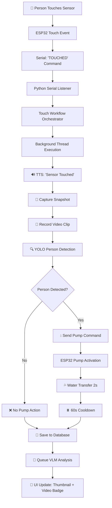

## 🔧 Detailed Component Flow

### 1. Hardware Layer (ESP32)

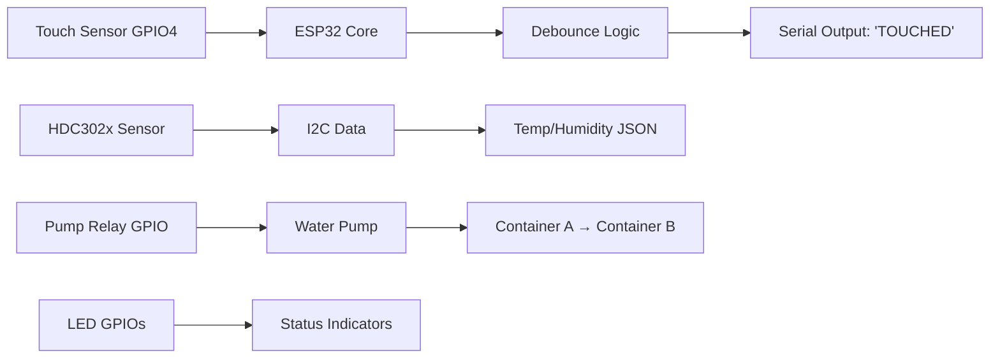

### 2. Software Layer (Python Backend)

```mermaid
graph TB
    A[serial_unified_listener.py] --> B[Parse Serial Data]
    B --> C{Message Type?}
    C -->|'TOUCHED'| D[handle_touch_event()]
    C -->|Sensor JSON| E[insert_sensor_reading()]
    D --> F[TouchWorkflowOrchestrator]
    F --> G[Background Thread]
    G --> H[_run_workflow()]
    H --> I[_capture_snapshot()]
    I --> J[capture_webcam_image()]
    H --> K[_record_video()]
    K --> L[record_video_alert()]
    H --> M[_run_yolo()]
    M --> N[process_image_for_person_detection()]
    N --> O{person_detected?}
    O -->|True| P[_trigger_pump()]
    O -->|False| Q[Skip Pump]
    P --> R[ser.write('PUMP_ON_YELLOW_LEAVES')]
    H --> S[_save_to_database()]
    S --> T[insert_snapshot_quick()]
    H --> U[_queue_vlm_analysis()]
```

### 3. Database Flow

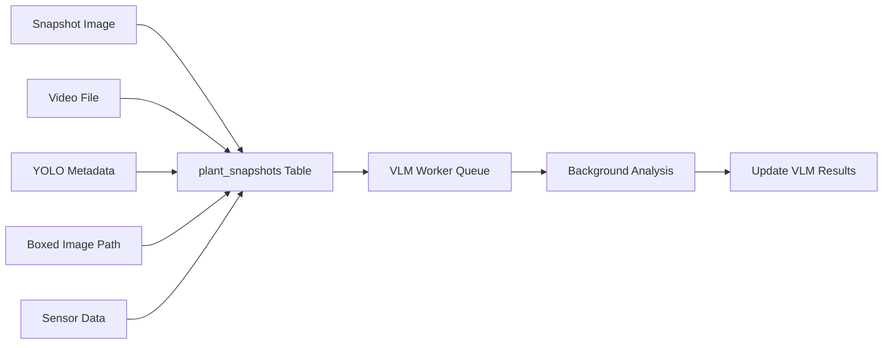

### 4. UI/Visualization Flow

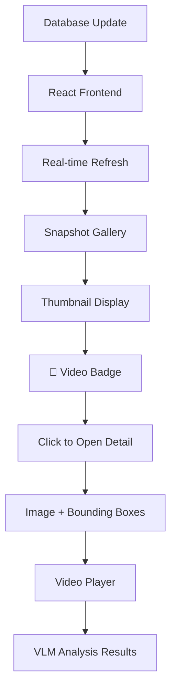

## 🚀 Complete End-to-End Flow

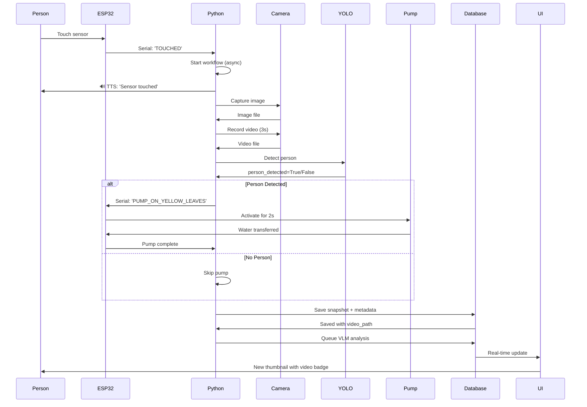

## ⚙️ Configuration & Decision Points

### Video Recording Configuration
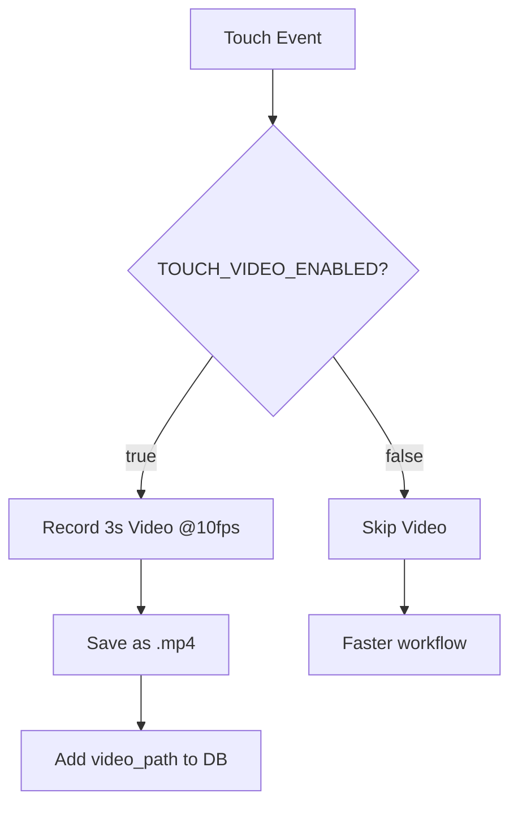

### Pump Decision Logic
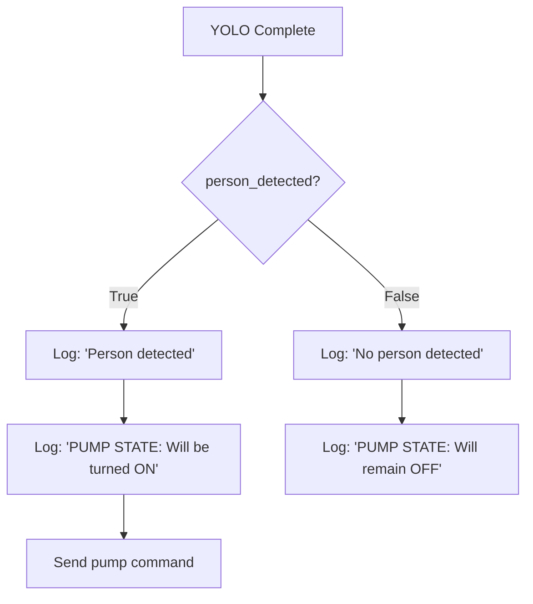

### Database Storage Flow
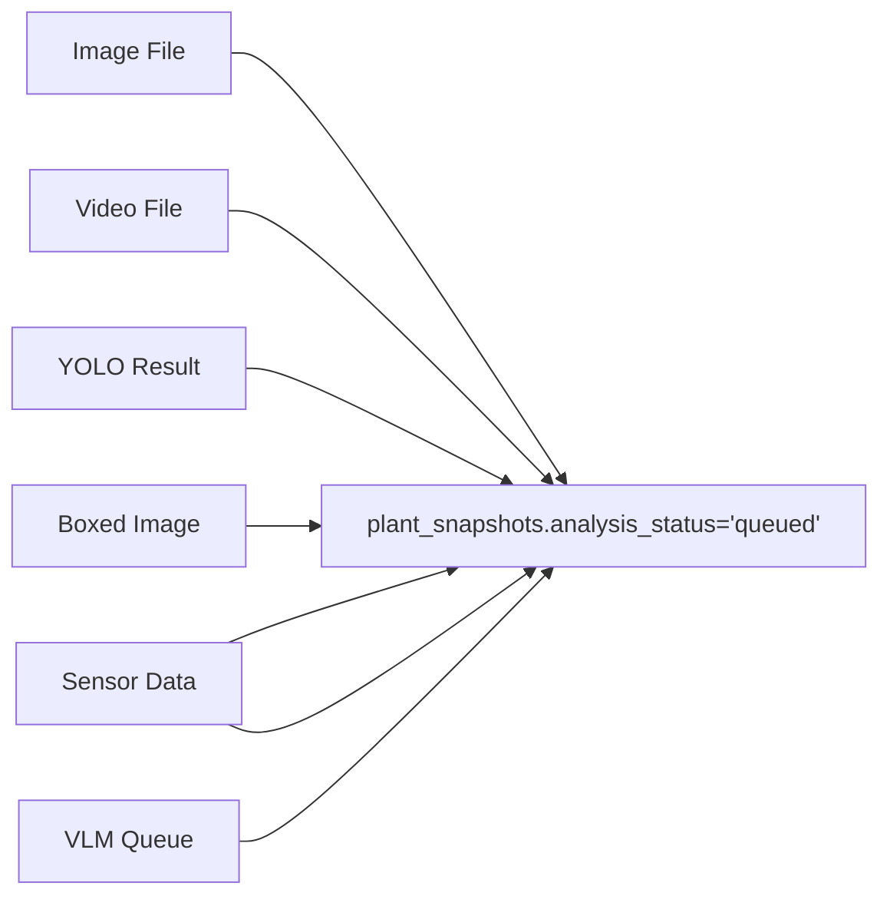

## 🔄 Continuous Monitoring Flow (Non-Touch Events)

```mermaid
graph TD
    A[ESP32 Temperature Loop] --> B[Serial: Sensor JSON]
    B --> C[Python: parse_sensor_data()]
    C --> D[Database: insert_sensor_reading()]
    D --> E[UI: Update live charts]
    E --> F[Check Temperature Threshold]
    F --> G{Temp >= 25°C?}
    G -->|Yes| H[🔥 Temperature Alert]
    G -->|No| I[Continue Monitoring]
    H --> J[DISABLED: No auto-snapshot]
    J --> I
```

## 📱 UI Component Interaction

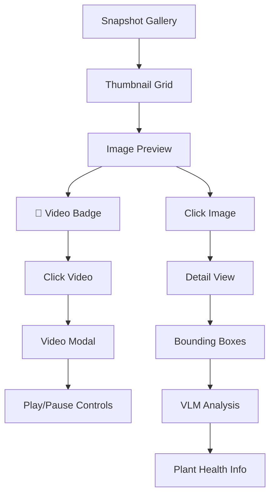

## 🚨 Error Handling Flow

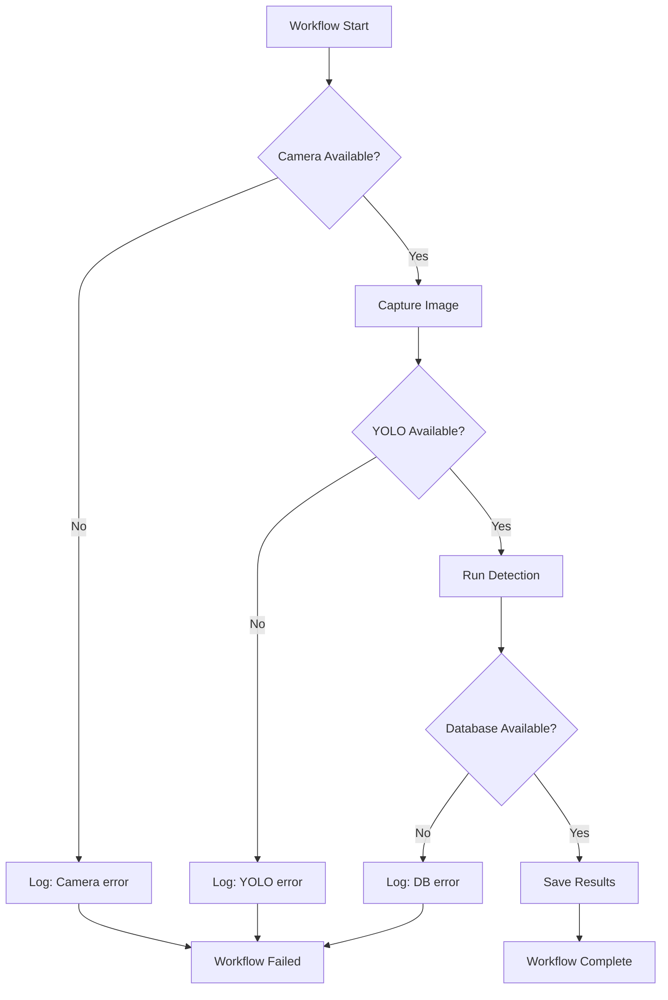

## 📊 Performance Metrics Flow

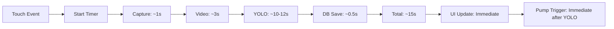

---

## 🎯 Key Features Illustrated

1. **Non-blocking Architecture**: Serial listener continues working while workflow runs in background
2. **Smart Decision Making**: Pump only activates when person is detected
3. **Rich Data Capture**: Image + video + YOLO metadata + VLM analysis
4. **Real-time UI**: Immediate updates with video badges and thumbnails
5. **Robust Error Handling**: Graceful degradation when components fail
6. **Configurable Performance**: Video recording can be disabled for speed
7. **Comprehensive Logging**: Full audit trail of all decisions and actions

This flow diagram represents the complete PlantGuard AI system from human interaction to automated plant care! 🌱🤖💧
